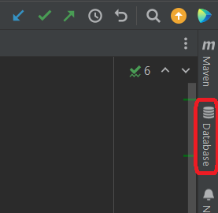
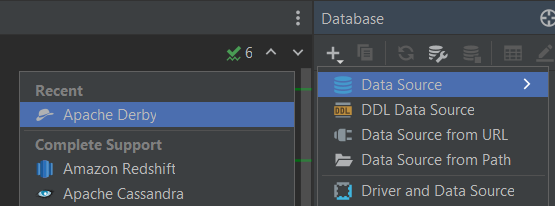
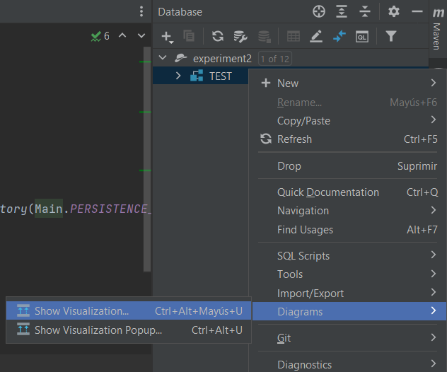
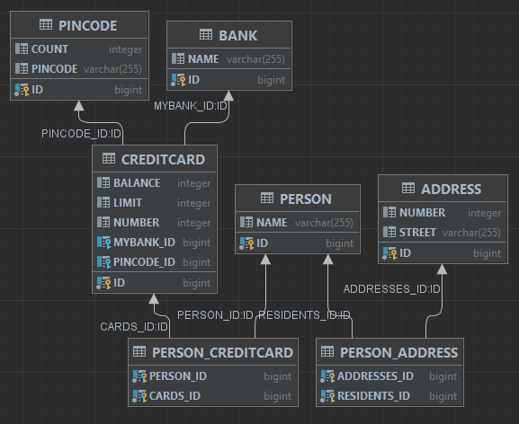

# Assignment 2 - JPA
The goal of this experiment was to create and persist some objects in a database using JPA and the correct anotations.

## Installation
Since all the libraries needed to run the given projects were already contained in them, no software installation was carried out and therefore no problems were faced.

## Database
In order to inspect the database schema after at least one execution, first we have to go to the Database menu in IntelliJ.

    

Now if it is our first time we need to add a new database, wich in this case is an Apache Derby one.

    

Once it has been added choosing the right path and using the user and password that can be found in the `persistence.xml` file within the project (a link to the project will be provided a the bottom of this report), we are able to see that a schema with the name "Test" is shown. After right-click on it whe choose `Diagrams > Show Visualization`

    

And finally, this is the database schema generated according to the code I wrote and executed.

    

## Link to the code
[Source code](https://github.com/FelixExDe/DAT250/tree/main/experiment-2)