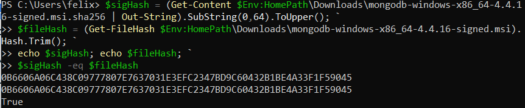
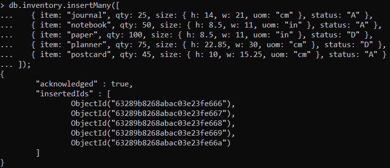
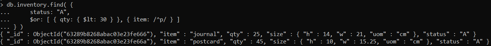
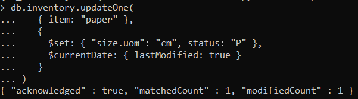
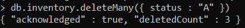
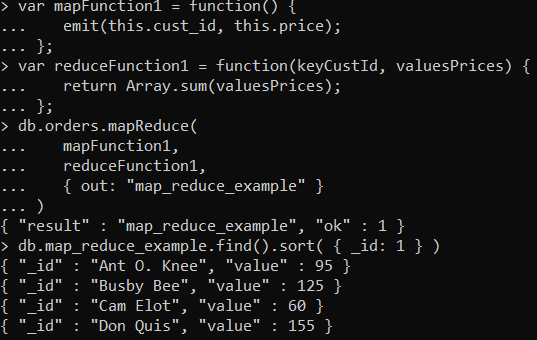
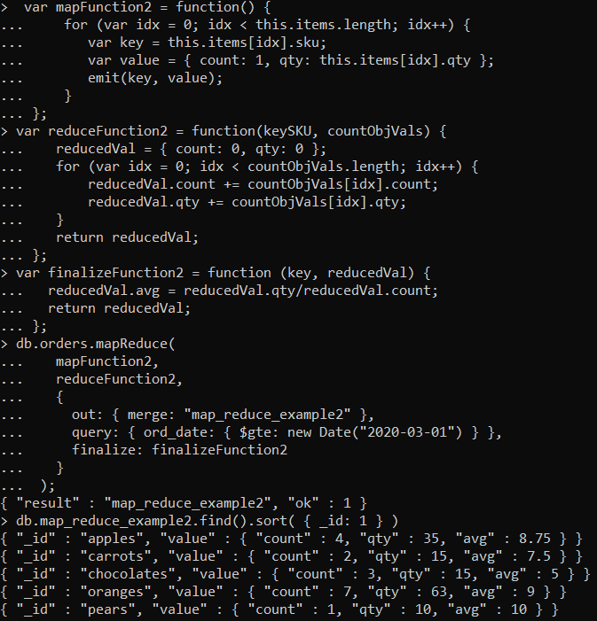
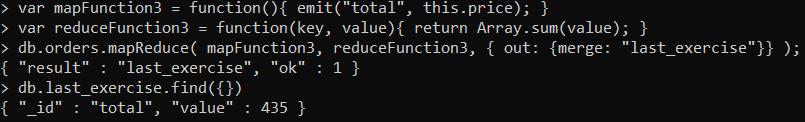

# Assignment 3 - MongoDB
The goal of this assignment is to perform and understand basic CRUD operations as well as aggregation.

## Installation
I installed [this version](https://fastdl.mongodb.org/windows/mongodb-windows-x86_64-4.4.16-signed.msi) (4.4) of MongoDB for a machine running Windows 11 Home. All the exercises were carried out in the computer shell.

## Validation
Following the steps given in the [validation tutorial for Windows](https://www.mongodb.com/docs/v4.4/tutorial/verify-mongodb-packages/#verify-windows-packages) we can observe in this output that the copy downloaded has been verified successfully.

    

## Experiment 1
### C
Here we can see the data we will be working with from now. In this case I used `inserMany` instead of `insertOne` because it allows me to insert some elements contained in an array at once. Every element has been given an id.

    

 

### R
Using the function `find` we can look for the elements that match the query, which in this case are the ones whose status is "A" and either the quantity is less than 30 or the item name starts with the letter "p".

    

 

### U
With `updateOne` we can change the value of a field or even create a new one in the first element found that matches the query, which in this case is having "paper" as item name.

    

 

### D
Finally, we use the operation `deleteMany` in order to get rid of all the elements that match the requirement given as a parameter to the function. 3 elements were deleted as we can see, we can even check the screenshot from the first crud operation to ensure that there was 3 elements with status "A".

    

 

## Experiment 2
### Example 1
Example one performed as expected as it was carried out following each step as shown in the tutorial. That's why the output is the same.

    

 

### Example 2
Example two performed as expected as it was carried out following each step as shown in the tutorial.
That's why the output is the same.

    

 

### My map-reduce
I implemented an operation for the same dataset used in the two examples above. My operation will calculate the the total revenue of the business. For that purpose, first my map operation extracts the value of each purchase a client has done and I emit a key-value element for which the key is constant as later I want to add all the tickets. That is done with the reduce function, that takes an array belonging to the "total" element and gives only one output (as planned) in which we can observe the total revenue of the shop.

    

